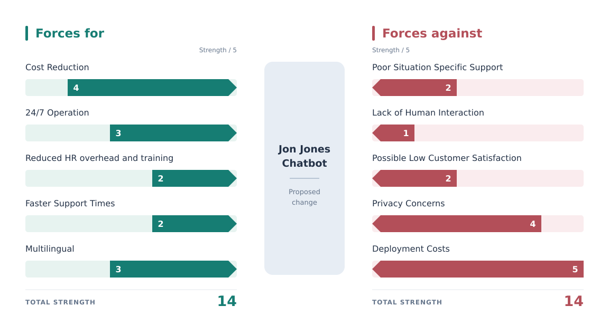

# Buisness Case

The purpose of this document is to outline the buisness case for developing and deploying a customer facing support chatbot at scale.

The purpose of this project is to reduce operating costs and streamline the support experience for end users by providing faster assistance. We have 50 human support staff which costs us upwards of £1.15 million per annum. If we can reduce the amount of staff to 10 (80% reduction), we can lower this figure to £185k per annum, not including overhead costs such as office space, equipment and other expenses.

## Management Summary

The current support process relies heavily on manual human support via a dedicated support team, even for the most common routine inquiries. This can result in long wait periods for common questions, limits the availability of support outside of working hours and prevents us from solving more complex customer inquiries.

Though this project, we have an opportunity to reduce overhead costs by delegating the simpler routine support inquries to a lower cost AI support team. This will improve the operating efficiency of the support team and reduce the amount of human staff required.

By completing this project, we can build a working client relationship with Johnathon Johnes, who operates a multi-million dollar enterprise.

## Alternative Options

### Outsource customer support to a 3rd party call centre

- Indian accent (language barrier) is poorly recieved by customers and harms brand image.
- Higher operational costs compared to inhouse soloution.
- Call centres might be unavailable during buisness hours (timezone differences)
- customer support experience is more generic and less tailored to our company

## Asyncronous Visual/Interactive demos

- Costly to produce
- Need to be reproduced if a product has a design change
- Not accessible to impared customers

### Direct customers to an FAQ page

- Too generic to accomodate the unique experience of each customer

### Do nothing

- opportunity cost of >£800k

## Force Field
<!-- 
| for                                         | score | against                            | score |
|---------------------------------------------|-------|------------------------------------|-------|
| Cost Reduction                              | 4     | Poor Situation Specific Support    | 2     |
| 24/7 operations                             | 3     | Lack of human interaction          | 1     |
| reduced HR overhead and training            | 2     | possible low customer satisfaction | 2     |
| Faster support turn around time             | 2     | Privacy concerns                   | 4     |
| multilingual support (internationalisation) | 3     | development costs                  | 5     | -->

We can mitigate the impact of development costs by allocationg a portion of the budget as a reserve for any unexpected costs.

In order to address any privacy concerns we can audit the software for regulatory compliace with GDPR, DPA, and ensure we do not log any unnecessary information.

Low situation specific support and lack of human interaction are low impact forces during the inial project scope as we are retaining 10 fallback support staff to handle this specific situation.

---

## Goals

- reduce support costs by reducing human staff headcount
- provide fast and low cost customer support service
- meet compliance goals
