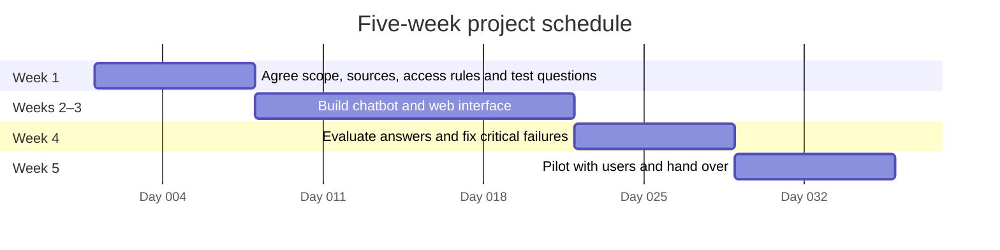

# Summary

The goal of the project is to create a chatbot that answers customer support queries at a lower cost than human employees. Jon Jones wants to reduce customer support operating costs.

## Scope

### Goals

- Budget of £15,000
- demonstrably reduce customer support costs by 25% over a quarter, compared with an agreed baseline
- reduce the duration of support sessions by providing accurate, faster responses
- agree which queries the chatbot will handle and when to refer users to human support
- deliver within the agreed budget, deadline and quality requirements

### Out of Scope

- replacing all human customer support
- handling queries outside the agreed support topics
- adding channels or system integrations beyond those agreed with the client

## Client Questions

1) What interaction formats do we want (text, audio, etc.)?
2) Does the £15,000 budget include operating costs?
    - If so, how should it be split?
3) What is the deadline for deploying the chatbot to production?
4) Which support queries and systems should it cover?
    - What support content is available?
5) What are the current support costs and resolution times?
    - How will we measure success (metrics)?
6) Who will approve the chatbot?
    - Who will maintain it after deployment?
7) What is the current volume of incoming client calls?
    - Do you have a list of FAQs?
8) What kind of outcomes are expected?
    - Have we missed any requirements?
9) Do you want to handle human fallback?
    - If so, do you have any strict criteria or process in mind for this?
    - Do you have an organisational topology diagram we can use to implement routing?
10) Do you have a dataset of past support interactions we can use to train the model and evaluate the overall performance of the system?
11) Are you planning to host this on prem or outsource the hosting to someone else?
    - Do you have any exisitng infrastructure or technology stack in place?

## Development

### Team and staffing cost

| Staff                            | Responsibility                                               | Days over 5 weeks |          Cost |
|----------------------------------|--------------------------------------------------------------|------------------:|--------------:|
| 9 — Dev Web                      | Technical lead; builds the web chatbot and integrations      |                25 |     £3,846.15 |
| 14 — Placement Student           | Application developer; builds and tests features             |                25 |     £2,403.85 |
| 3 — Business Analyst             | Defines requirements, test questions and acceptance criteria |               2.5 |       £432.69 |
| 2 — TDA                          | Reviews the solution design, data access and security        |               2.5 |       £480.77 |
| **Core team total**              |                                                              |            **55** | **£7,163.46** |
| 8 — SQL DBA (optional)           | Supports database access if the chatbot uses SQL data        |                 2 |       £269.23 |
| **Total including optional DBA** |                                                              |            **57** | **£7,432.69** |

### Budget

| Item                                    |        Amount |
|-----------------------------------------|--------------:|
| Total project budget                    |    £15,000.00 |
| Core staffing                           |    −£7,163.46 |
| Optional SQL DBA: up to 2 days          |      −£269.23 |
| **Remaining, including DBA allocation** | **£7,567.31** |

The remaining budget covers hosting, model usage, other project costs and contingency. Staffing costs are derived from annual salaries, not employer charge-out rates.

### Five-week schedule

| Week | Deliverable                                                    |
|------|----------------------------------------------------------------|
| 1    | Agree scope, approved sources, access rules and test questions |
| 2–3  | Build the chatbot and web interface                            |
| 4    | Evaluate answers and fix critical failures                     |
| 5    | Pilot with users and hand over                                 |

The chart uses a placeholder start date to show relative days across five weeks; the actual start date is to be agreed with the client.

## Risk

1) the agent could provide the wrong answer to the users question.
    - AB test the support agent with a small set of users to validate answers
2) the agent cannot be held accountable for lawsuits or legal risk.
    - insurance
    - legal review and corporate compliance
3) users might find the support agent frustrating to use.
    - human fallback is built into the system
4) if the support agent experiences a system outage then the company will be unable to provide customer support.
    - independent FAQs page
    - redundant deployments/replica sets
    - backups
    - fallback human support staff able to handle urgent queries over email
    - SLA
5) the results might be of a lower quality compared to the previous human call centre.
    - evaluations and testing to identify any weaknesses
    - using official company sources to generate answers
6) the project might exceed the allocated budget
    - actively monitor finances
    - keep to a strcit scope and prevent large changes without additional budget increases
7) the project might be delayed
    - implement a maximum time required to wait for PR reviews
    - keep scope well defined
    - analyze buisness goals in advance and avoid assumptions
    - Project manager actively monitors progress via weekly checkins

## Assumptions

1) no severe staff ilness/unavailability
2) client provides sufficiently clear answers to questions
3) no large scale system outages with external providers (e.g. github)
4) timely client feedback
5) support request volume is sufficiently low that generative AI is not prohibitively expensive and scaling is not a huge architectural concern.

## Acceptance Criteria

1) Client has a functional forward deployed customer support agent.
2) The agent can answer all incoming querues either automatically or by escalating to support workers for more complex queries.
3) We can measure an improved cost-per-query metric, and demonstrate that the agent is cheaper to operate overall compared to the previous call centre.
4) The client has successfully transitioned to the new automated agent in production
